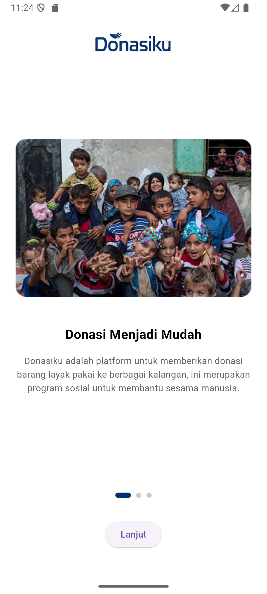

# Donasiku



[](https://flutter.dev)
[](https://firebase.google.com)
[](LICENSE)
[](#)

Donasiku adalah platform aplikasi mobile yang menjembatani para donatur dengan penerima manfaat secara transparan dan efisien. Aplikasi ini dirancang untuk mempermudah proses penyaluran bantuan, mulai dari identifikasi kebutuhan di area sekitar hingga pelacakan status bantuan secara real-time.

---

## Daftar Isi

1. [Gambaran Proyek](#gambaran-proyek)
2. [Fitur Utama](#fitur-utama)
3. [Teknologi yang Digunakan](#teknologi-yang-digunakan)
4. [Struktur Proyek](#struktur-proyek)
5. [Prasyarat Sistem](#prasyarat-sistem)
6. [Langkah Instalasi](#langkah-instalasi)
7. [Konfigurasi Firebase](#konfigurasi-firebase)
8. [Dokumentasi SRS](#dokumentasi-srs)
9. [Kontribusi](#kontribusi)
10. [Lisensi](#lisensi)

---

## Gambaran Proyek

Donasiku berfokus pada kemudahan akses bagi masyarakat yang ingin berbagi dan bagi mereka yang membutuhkan bantuan. Dengan integrasi peta dan layanan lokasi, pengguna dapat menemukan titik-titik kebutuhan donasi di sekitar mereka. Aplikasi ini juga menyediakan fitur komunikasi langsung untuk memastikan koordinasi yang lebih baik antara pihak-pihak terkait.

## Fitur Utama

- **Pencarian Area (Geolokasi):** Menampilkan daftar donasi yang tersedia berdasarkan radius jarak dari pengguna.
- **Manajemen Donasi:** Alur penambahan item donasi, pengelolaan status, hingga verifikasi penerimaan.
- **Chat Real-time:** Sistem pesan instan untuk koordinasi langsung antara donatur dan penerima.
- **Dashboard Multi-Role:** Tampilan antarmuka yang disesuaikan untuk Donatur, Penerima, dan Admin.
- **Pelacakan Riwayat:** Rekam jejak lengkap dari semua transaksi donasi yang pernah dilakukan.
- **Verifikasi Dokumen:** Fitur unggah KTP/SKTM untuk proses validasi akun penerima manfaat.

## Teknologi yang Digunakan

- **Framework:** Flutter (Dart)
- **Backend & Database:** Firebase (Firestore, Authentication, Storage)
- **State Management:** Provider
- **Peta:** Flutter Map & Geolocator
- **UI:** Google Fonts & Custom Theme System

## Struktur Proyek

```text
lib/
├── models/             # Definisi skema data
├── modules/            # Modul fitur spesifik (pencarian_area)
├── screens/            # Antarmuka pengguna (UI)
│   ├── dashboards/     # Dashboard berbasis role
│   └── auth/           # Alur login dan registrasi
├── services/           # Logika Firebase dan API external
├── widgets/            # Komponen UI yang reusable
└── theme.dart          # Konfigurasi gaya visual aplikasi
```

## Prasyarat Sistem

Sebelum memulai, pastikan perangkat Anda telah memenuhi syarat berikut:

- Flutter SDK v3.11.0 atau versi yang lebih tinggi.
- Dart SDK yang kompatibel.
- Android Studio / VS Code dengan plugin Flutter terpasang.
- Perangkat fisik atau Emulator (Android/iOS).

## Langkah Instalasi

1. **Clone Repositori**
   ```bash
   git clone https://github.com/athallacode/donasiku.git
   cd donasiku
   ```

2. **Instalasi Dependensi**
   ```bash
   flutter pub get
   ```

3. **Menjalankan Aplikasi**
   ```bash
   flutter run
   ```

## Konfigurasi Firebase

Proyek ini menggunakan Firebase. Karena file konfigurasi diabaikan dalam kontrol versi demi alasan keamanan, Anda perlu melakukan langkah berikut:

1. Buat proyek baru di [Firebase Console](https://console.firebase.google.com/).
2. Tambahkan aplikasi Android dan iOS ke proyek Firebase tersebut.
3. Unduh file `google-services.json` dan letakkan di:
   - `android/app/google-services.json`
4. Unduh file `GoogleService-Info.plist` dan letakkan di:
   - `ios/Runner/GoogleService-Info.plist`
5. Aktifkan layanan **Authentication**, **Cloud Firestore**, dan **Storage**.

## Dokumentasi SRS

Dokumen spesifikasi kebutuhan perangkat keras dan lunak (SRS) yang mendasari pengembangan aplikasi ini dapat diakses pada tautan berikut:
[Lihat Dokumen SRS](docs/Donasiku%20SRS.pdf)

## Kontribusi

Kami menerima kontribusi dalam bentuk apapun. Jika Anda menemukan bug atau memiliki ide fitur baru, silakan buka *Issue* atau kirimkan *Pull Request*.

1. Fork repositori ini.
2. Buat branch fitur baru (`git checkout -b fitur/NamaFitur`).
3. Commit perubahan Anda (`git commit -m 'Menambahkan fitur XYZ'`).
4. Push ke branch tersebut (`git push origin fitur/NamaFitur`).
5. Buat Pull Request.

## Lisensi

Proyek ini dilisensikan di bawah **MIT License**. Lihat file [LICENSE](LICENSE) untuk detail lebih lanjut.
