# Donasiku 🤝

<p align="center">
  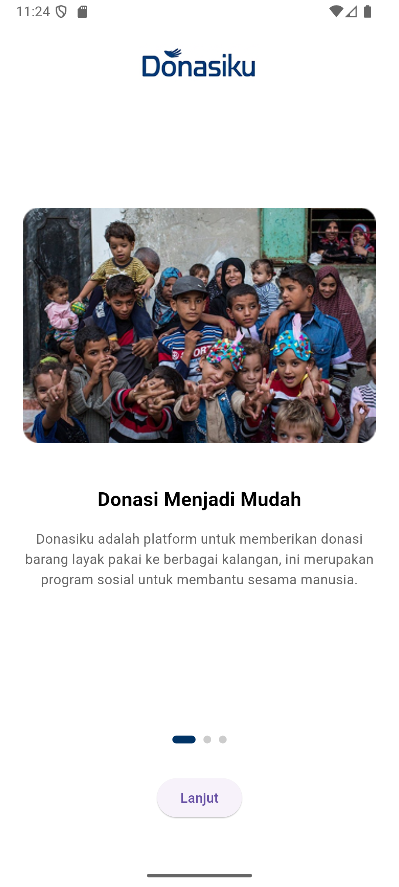
</p>

<p align="center">
  <a href="https://flutter.dev"></a>
  <a href="https://firebase.google.com"></a>
  <a href="LICENSE"></a>
  
  
</p>

<p align="center">
  <b>Platform donasi barang layak pakai yang menghubungkan donatur dan penerima secara transparan, aman, dan efisien.</b>
</p>

---

## 📋 Daftar Isi

1. [Gambaran Proyek](#-gambaran-proyek)
2. [Fitur Utama](#-fitur-utama)
   - [Autentikasi & Onboarding](#1-autentikasi--onboarding)
   - [Dashboard Donatur](#2-dashboard-donatur)
   - [Dashboard Penerima](#3-dashboard-penerima)
   - [Tambah Donasi](#4-tambah-donasi)
   - [Pencarian Area (Geolokasi)](#5-pencarian-area-geolokasi)
   - [Manajemen Donasi](#6-manajemen-donasi)
   - [Tracking Donasi](#7-tracking-donasi)
   - [Chat Real-time](#8-chat-real-time)
   - [Profil Pengguna](#9-profil-pengguna)
   - [Riwayat Donasi](#10-riwayat-donasi)
   - [Verifikasi Admin](#11-verifikasi-admin)
   - [Mode Tamu (Guest)](#12-mode-tamu-guest)
3. [Teknologi yang Digunakan](#️-teknologi-yang-digunakan)
4. [Struktur Proyek](#-struktur-proyek)
5. [Prasyarat Sistem](#-prasyarat-sistem)
6. [Langkah Instalasi](#-langkah-instalasi)
7. [Konfigurasi Firebase](#-konfigurasi-firebase)
8. [Alur Pengguna](#-alur-pengguna)
9. [Dokumentasi](#-dokumentasi)
10. [Kontribusi](#-kontribusi)
11. [Lisensi](#-lisensi)

---

## 🌟 Gambaran Proyek

**Donasiku** adalah aplikasi mobile berbasis Flutter yang menjembatani para donatur dengan penerima manfaat secara transparan dan efisien. Aplikasi ini dirancang untuk mempermudah proses penyaluran bantuan barang layak pakai, mulai dari identifikasi kebutuhan di area sekitar hingga pelacakan status bantuan secara real-time.

### Mengapa Donasiku?

| Masalah | Solusi Donasiku |
|---------|----------------|
| Sulitnya menemukan penerima manfaat yang tepat | Sistem geolokasi untuk menemukan penerima terdekat |
| Tidak ada transparansi dalam proses donasi | Status tracking real-time dari "Tersedia" hingga "Diterima" |
| Koordinasi yang sulit antara donatur dan penerima | Fitur chat langsung terintegrasi |
| Risiko penyalahgunaan donasi | Sistem verifikasi KTP/SKTM untuk penerima |

---

## ✨ Fitur Utama

### 1. Autentikasi & Onboarding

Pengalaman pertama pengguna dirancang dengan mulus, mulai dari layar splash animasi, onboarding informatif, kebijakan privasi, hingga registrasi dengan pemilihan peran.

<p align="center">
  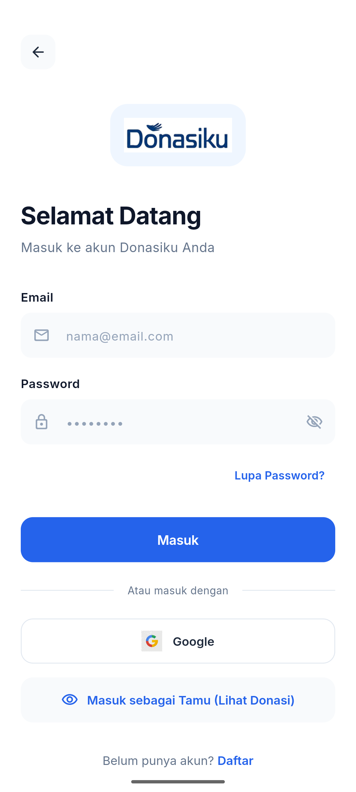
  &nbsp;&nbsp;
  
  &nbsp;&nbsp;
  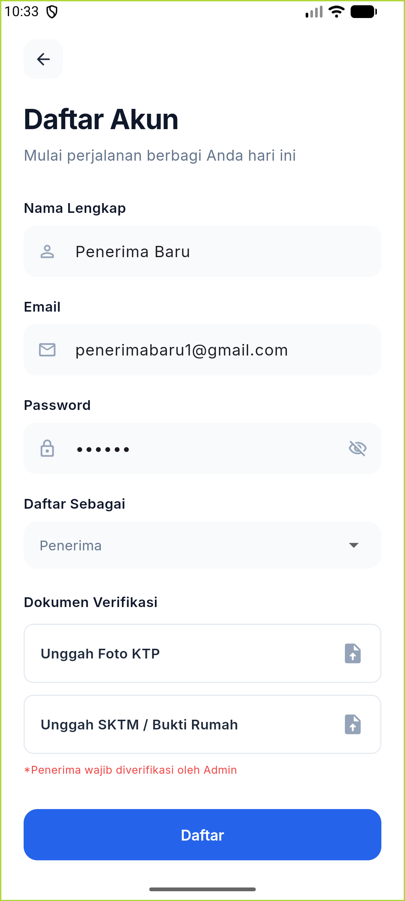
</p>


**Fitur detail:**
- 🎬 **Splash Screen** — Animasi logo saat aplikasi pertama kali dibuka.
- 📖 **Onboarding 3 Halaman** — Pengenalan konsep donasi Donasiku secara visual.
- 📜 **Kebijakan Privasi** — Pengguna wajib menyetujui syarat & ketentuan sebelum mendaftar.
- 🔐 **Login / Register** — Autentikasi menggunakan Email & Password via Firebase Auth.
- 👤 **Pemilihan Peran** — Pengguna memilih antara **Donatur** atau **Penerima** saat mendaftar.
- 🔍 **Google Sign-In** — Opsi masuk cepat menggunakan akun Google.

---

### 2. Dashboard Donatur

Dashboard khusus untuk donatur yang menampilkan ringkasan aktivitas donasi, sistem gamifikasi level, dan daftar donasi yang sedang aktif.

<p align="center">
  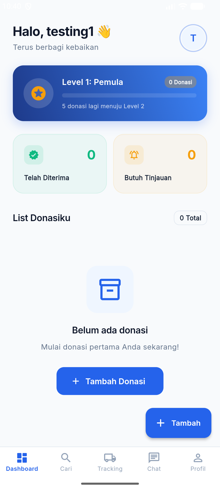
  &nbsp;&nbsp;
  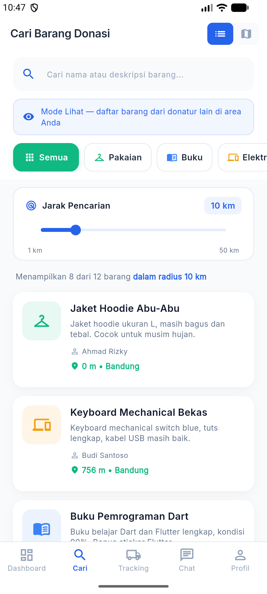
  &nbsp;&nbsp;
  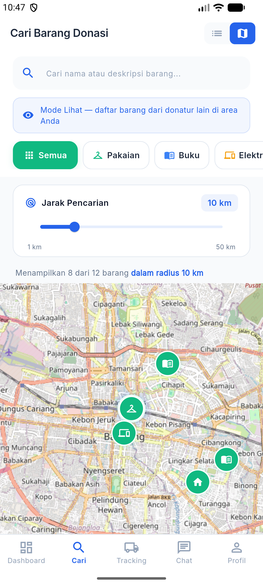
</p>

**Fitur detail:**
- 🏆 **Sistem Gamifikasi Level** — Donatur mendapatkan level (Pemula → Peduli → Pahlawan) berdasarkan jumlah donasi dengan progress bar visual.
- 📊 **Statistik Donasi** — Menampilkan jumlah donasi selesai (Diterima) dan permintaan yang menunggu.
- 🌟 **Dampak Donasi** — Visualisasi kategori barang yang paling sering didonasikan.
- 📋 **Daftar Donasi Aktif** — Kartu donasi dengan status berwarna (Tersedia, Diproses, Dikirim, Diterima).
- 🔔 **Notifikasi Permintaan** — Badge merah pada donasi yang memiliki permintaan menunggu.
- ➕ **FAB Tambah Donasi** — Tombol aksi cepat untuk menambah donasi baru.

---

### 3. Dashboard Penerima

Halaman utama untuk penerima yang menampilkan semua donasi tersedia, panduan cara meminta, dan kategori untuk memfilter barang.

<p align="center">
  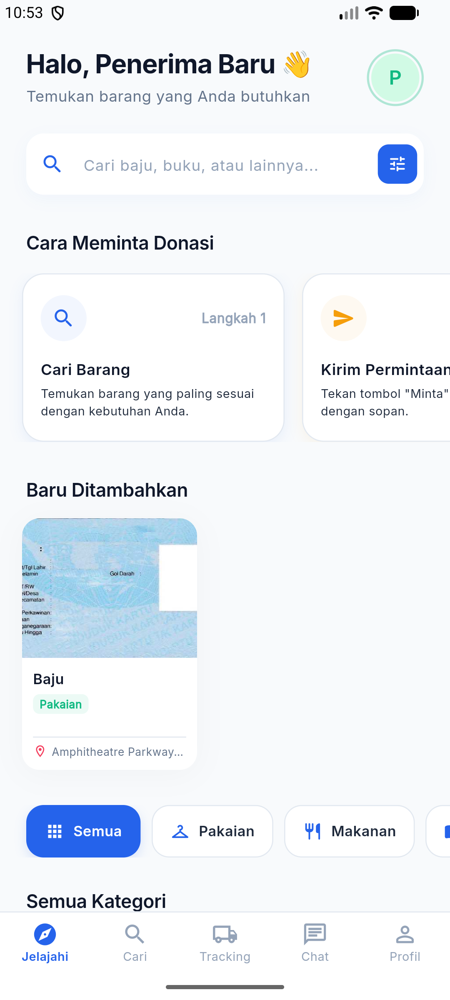
</p>

**Fitur detail:**
- 🔎 **Pencarian Pintar** — Search bar dengan filter kategori (Pakaian, Makanan, Buku, Elektronik, Lainnya).
- 📚 **Panduan 4 Langkah** — Kartu horizontal yang memandu penerima dari "Cari Barang" hingga "Ambil Barang".
- 🆕 **Baru Ditambahkan** — Carousel horizontal menampilkan 4 donasi terbaru berdasarkan waktu.
- 📦 **Grid Donasi** — Tampilan kartu donasi 2 kolom dengan gambar, kategori, dan lokasi.
- ⚠️ **Mode Preview** — Penerima yang belum diverifikasi bisa melihat tapi tidak bisa berinteraksi dengan banner peringatan.

---

### 4. Tambah Donasi

Form lengkap untuk donatur menambahkan item donasi baru dengan upload foto, kategori, lokasi, dan deskripsi.

<p align="center">
  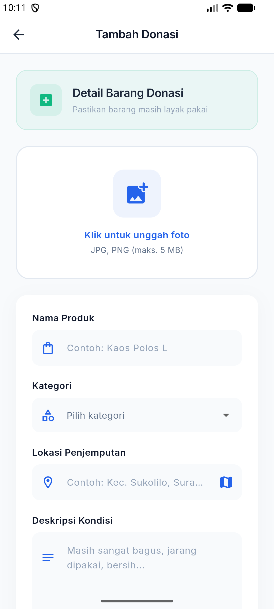
</p>

**Fitur detail:**
- 📸 **Upload Foto** — Ambil foto dari kamera atau galeri menggunakan `image_picker`.
- 🏷️ **Kategori Barang** — Dropdown pilihan kategori (Pakaian, Makanan, Buku, Elektronik, Lainnya).
- 📍 **Lokasi Penjemputan** — Input lokasi penjemputan/pengiriman barang.
- 📝 **Deskripsi Kondisi** — Kolom teks untuk mendeskripsikan kondisi barang.
- ✅ **Validasi Form** — Semua field wajib diisi sebelum dapat menyimpan.
- 🔄 **Edit Donasi** — Donatur dapat mengedit donasi yang sudah ada.

---

### 5. Pencarian Area (Geolokasi)

Modul pencarian berbasis lokasi yang memungkinkan pengguna menemukan donasi di sekitar mereka menggunakan peta interaktif.

<p align="center">
  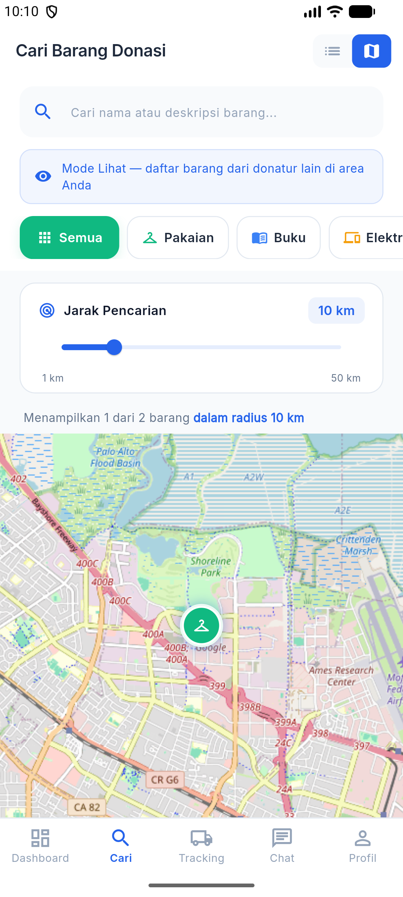
</p>

**Fitur detail:**
- 🗺️ **Peta Interaktif** — Integrasi `flutter_map` dengan OpenStreetMap untuk visualisasi peta.
- 📍 **Lokasi Pengguna** — Deteksi lokasi terkini menggunakan `geolocator`.
- 🔵 **Marker Donasi** — Marker pada peta menunjukkan posisi item donasi yang tersedia.
- 📏 **Filter Radius** — Pencarian berdasarkan radius jarak dari posisi pengguna.
- 👻 **Mode Guest** — Pengguna tamu dapat melihat peta tanpa perlu login.
- 🔒 **Verifikasi Lokasi** — Fitur aksi hanya tersedia untuk pengguna yang terverifikasi.

---

### 6. Manajemen Donasi

Halaman detail untuk donatur mengelola satu item donasi: melihat daftar pemohon, menerima/menolak permintaan, dan memantau status.

**Fitur detail:**
- 👥 **Daftar Pemohon** — Melihat semua pengguna yang mengajukan permintaan untuk item donasi.
- ✅ **Terima / Tolak Permintaan** — Donatur dapat memilih siapa yang mendapatkan donasi.
- 📋 **Detail Lengkap** — Foto barang, kategori, deskripsi, dan status ditampilkan lengkap.
- 💬 **Buka Chat** — Langsung membuka percakapan dengan pemohon yang dipilih.

---

### 7. Tracking Donasi

Layar untuk memantau status pengiriman donasi yang sedang aktif dengan timeline visual.

<p align="center">
  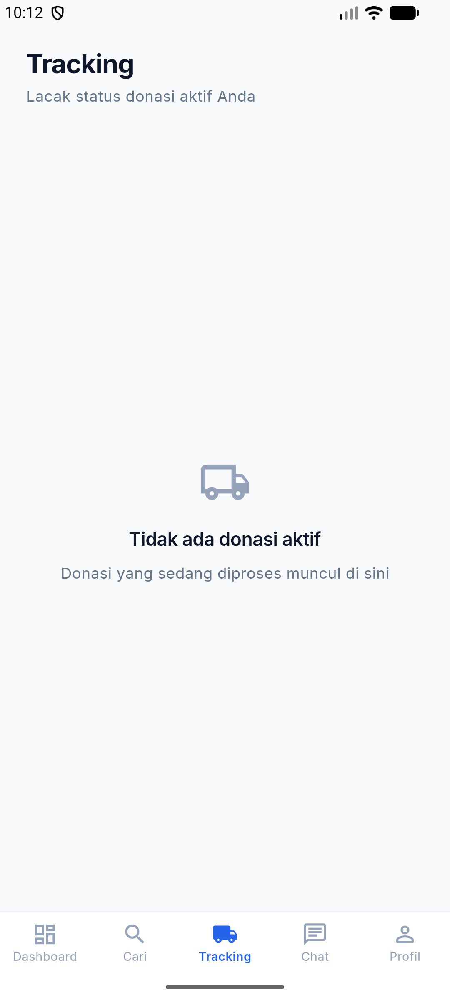
</p>

**Fitur detail:**
- ⏱️ **Timeline Visual** — Progress bar 3 tahap (Diproses → Dikirim → Diterima) dengan indikator warna.
- 🚚 **Aksi Status Donatur** — Tombol "Kirim Barang" untuk mengubah status menjadi "Dikirim".
- ✅ **Konfirmasi Penerima** — Tombol "Konfirmasi Diterima" untuk penerima menandai donasi selesai.
- 💬 **Shortcut Chat** — Akses cepat ke percakapan langsung dari kartu tracking.
- 🎭 **Multi-Role View** — Tampilan disesuaikan antara Donatur dan Penerima.

---

### 8. Chat Real-time

Sistem pesan instan antar donatur dan penerima untuk koordinasi lokasi dan waktu penjemputan.

**Fitur detail:**
- 💬 **Chat Langsung** — Percakapan real-time menggunakan Firebase Firestore streams.
- 📋 **Daftar Chat** — Halaman list semua percakapan aktif dengan preview pesan terakhir.
- 🔔 **Notifikasi Push** — Notifikasi lokal saat ada pesan baru menggunakan `flutter_local_notifications`.
- 🕐 **Timestamp Pesan** — Waktu pengiriman ditampilkan di setiap pesan.
- 🔒 **Read-Only Mode** — Penerima yang belum terverifikasi hanya bisa melihat chat tanpa bisa mengirim.

---

### 9. Profil Pengguna

Halaman profil yang menampilkan informasi akun, opsi edit data, upload foto profil, dan pengaturan akun.

**Fitur detail:**
- 🖼️ **Foto Profil** — Upload dan perbarui foto profil dari galeri atau kamera.
- ✏️ **Edit Profil** — Ubah nama tampilan dan informasi akun.
- 📄 **Upload Dokumen (Penerima)** — Upload foto KTP dan SKTM untuk proses verifikasi.
- 🔴 **Keluar** — Tombol logout dengan konfirmasi.
- 👁️ **Preview Mode** — Profil penerima yang pending verifikasi ditampilkan dengan status "Menunggu Verifikasi".

---

### 10. Riwayat Donasi

Rekam jejak lengkap semua aktivitas donasi yang telah selesai atau dibatalkan.

**Fitur detail:**
- 📜 **Riwayat Lengkap** — Daftar semua donasi yang pernah dilakukan/diterima.
- 🎨 **Badge Status** — Warna status berbeda untuk setiap tahap (Tersedia, Diproses, Dikirim, Diterima).
- 📅 **Informasi Tanggal** — Tanggal pembuatan donasi ditampilkan pada setiap kartu.

---

### 11. Verifikasi Admin

Panel admin khusus untuk memverifikasi atau menolak akun penerima berdasarkan dokumen yang diunggah.

<p align="center">
  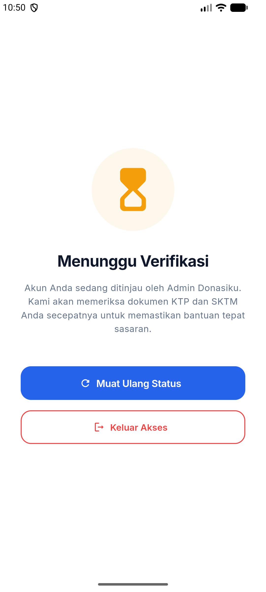
  &nbsp;&nbsp;
  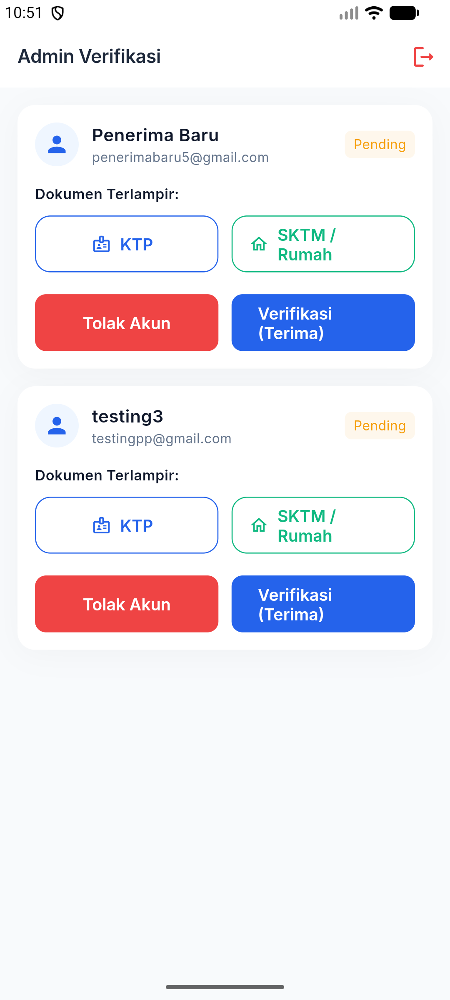
</p>

**Fitur detail:**
- 👀 **Review Dokumen** — Admin dapat melihat foto KTP dan SKTM/foto rumah yang diunggah.
- ✅ **Approve Akun** — Menyetujui akun penerima agar dapat menggunakan fitur penuh.
- ❌ **Reject Akun** — Menolak dan menghapus akun penerima yang tidak memenuhi syarat.
- 📋 **Queue Verifikasi** — Menampilkan antrian semua akun penerima yang menunggu verifikasi.
- 🔔 **State Kosong** — Tampilan konfirmasi jika semua akun sudah diverifikasi.

---

### 12. Mode Tamu (Guest)

Pengguna dapat menggunakan aplikasi sebagai tamu tanpa login untuk melihat donasi yang tersedia di area mereka.

<p align="center">
  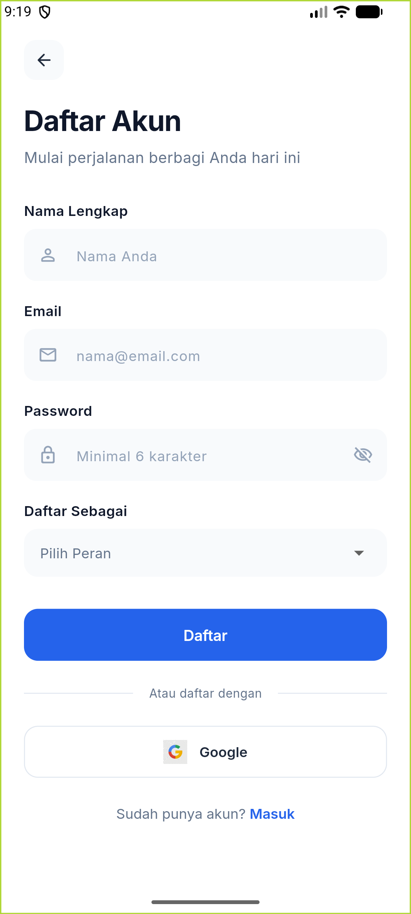
  &nbsp;&nbsp;
  
</p>

**Fitur detail:**
- 👻 **Akses Tanpa Akun** — Lihat daftar donasi dan peta tanpa perlu mendaftar.
- 🔒 **Batasan Aksi** — Tidak dapat mengajukan permintaan, chat, atau berinteraksi.
- 🔗 **Prompt Login** — Ajakan untuk mendaftar saat tamu mencoba melakukan aksi terbatas.

---

## 🛠️ Teknologi yang Digunakan

| Kategori | Teknologi | Versi |
|----------|-----------|-------|
| **Framework** | Flutter | SDK ^3.11.0 |
| **Bahasa** | Dart | ^3.11.0 |
| **Auth** | Firebase Authentication | ^5.1.0 |
| **Database** | Cloud Firestore | ^5.1.0 |
| **Storage** | Firebase Storage | ^12.4.10 |
| **State Management** | Provider | ^6.1.2 |
| **Peta** | Flutter Map (OpenStreetMap) | ^7.0.2 |
| **Geolokasi** | Geolocator | ^13.0.1 |
| **Gambar** | Image Picker + Cached Network Image | ^1.1.2 / ^3.4.1 |
| **Notifikasi** | Flutter Local Notifications | 18.0.1 |
| **Auth Sosial** | Google Sign-In | 6.2.1 |
| **UI** | Google Fonts | ^8.0.2 |
| **HTTP** | HTTP | ^1.2.2 |

---

## 📁 Struktur Proyek

```text
lib/
├── main.dart                    # Entry point & konfigurasi routing
├── theme.dart                   # Sistem desain & token warna global
│
├── models/                      # Definisi skema data
│   ├── donation_model.dart      # Model Donasi (status, kategori, dll)
│   └── chat_model.dart          # Model Pesan Chat
│
├── modules/
│   └── pencarian_area/          # Modul fitur Pencarian Berbasis Lokasi
│       ├── models/              # DonationItem, UserRole enum
│       ├── providers/           # DiscoveryProvider (state management peta)
│       ├── screens/             # DiscoveryScreen (UI peta)
│       ├── services/            # Layanan geolokasi & query Firestore
│       ├── utils/               # Helper kalkulasi jarak
│       └── widgets/             # Widget marker & kartu peta
│
├── screens/                     # Antarmuka pengguna (UI)
│   ├── auth/
│   │   ├── splash_screen.dart           # Layar awal animasi
│   │   ├── onboarding_screen.dart       # Pengenalan 3 halaman
│   │   ├── policy_screen.dart           # Kebijakan privasi
│   │   ├── login_screen.dart            # Login Email & Google
│   │   ├── register_screen.dart         # Registrasi dengan pemilihan peran
│   │   └── pending_verification_screen.dart  # Status menunggu verifikasi
│   │
│   ├── dashboards/
│   │   ├── donor_dashboard.dart         # Dashboard utama Donatur
│   │   ├── receiver_dashboard.dart      # Dashboard utama Penerima
│   │   └── admin_dashboard.dart         # Panel Verifikasi Admin
│   │
│   ├── dashboard_screen.dart            # Shell navigasi 5-tab (bottom nav)
│   ├── add_donation_screen.dart         # Form tambah donasi baru
│   ├── edit_donation_screen.dart        # Form edit donasi
│   ├── donation_detail_screen.dart      # Detail donasi + tombol Minta
│   ├── donation_management_screen.dart  # Manajemen pemohon (Donatur)
│   ├── tracking_screen.dart             # Tracking status pengiriman
│   ├── chat_list_screen.dart            # Daftar percakapan
│   ├── chat_screen.dart                 # Percakapan individual
│   ├── history_screen.dart              # Riwayat donasi selesai
│   └── profile_screen.dart             # Profil & edit akun
│
├── services/                    # Logika bisnis & komunikasi Firebase
│   ├── auth_service.dart        # Autentikasi, registrasi, manajemen sesi
│   ├── donation_service.dart    # CRUD donasi & manajemen status
│   ├── chat_service.dart        # Manajemen room chat & pesan
│   └── app_notification_service.dart  # Notifikasi lokal & pengingat harian
│
├── utils/                       # Utilitas umum
│   └── app_error_handler.dart   # Penanganan error terpusat & logging
│
└── widgets/                     # Komponen UI yang dapat digunakan ulang
    └── donation_image.dart      # Widget gambar donasi dengan cache & fallback
```

---

## ✅ Prasyarat Sistem

Sebelum memulai, pastikan perangkat Anda telah memenuhi syarat berikut:

- **Flutter SDK** v3.11.0 atau lebih tinggi
- **Dart SDK** yang kompatibel (disertakan bersama Flutter)
- **Android Studio** atau **VS Code** dengan ekstensi Flutter terpasang
- **Android Emulator** atau perangkat Android fisik (API Level 21+)
- Koneksi internet untuk layanan Firebase

---

## 🚀 Langkah Instalasi

### 1. Clone Repositori

```bash
git clone https://github.com/athallacode/donasiku.git
cd donasiku
```

### 2. Instalasi Dependensi

```bash
flutter pub get
```

### 3. Konfigurasi Firebase (wajib, lihat bagian berikut)

### 4. Jalankan Aplikasi

```bash
flutter run
```

---

## 🔥 Konfigurasi Firebase

Proyek ini membutuhkan Firebase. Karena file konfigurasi diabaikan dalam kontrol versi demi keamanan, ikuti langkah berikut:

1. **Buat Proyek Firebase** di [Firebase Console](https://console.firebase.google.com/).
2. **Tambahkan Aplikasi Android** ke proyek Firebase (gunakan package name: `com.example.donasiku`).
3. **Unduh & Letakkan** file konfigurasi:
   - `google-services.json` → `android/app/google-services.json`
4. **Aktifkan Layanan Firebase** berikut:
   - ✅ Authentication (Email/Password + Google Sign-In)
   - ✅ Cloud Firestore
   - ✅ Firebase Storage
5. **Buat Koleksi Firestore** awal:
   - `users` — data profil pengguna
   - `donations` — data item donasi
   - `chatRooms` — data room percakapan

---

## 🔄 Alur Pengguna

### Alur Donatur

```
Splash → Onboarding → Kebijakan → Register (Donatur) → Login
  → Dashboard Donatur → Tambah Donasi → Terima Permintaan
  → Tracking (Kirim Barang) → Selesai (Diterima)
```

### Alur Penerima

```
Splash → Onboarding → Kebijakan → Register (Penerima)
  → Upload KTP & SKTM → Menunggu Verifikasi Admin
  → [Setelah Diverifikasi] → Dashboard Penerima
  → Cari Donasi → Kirim Permintaan → Chat Koordinasi
  → Tracking → Konfirmasi Diterima
```

### Alur Admin

```
Login (Akun Admin) → Panel Verifikasi → Review Dokumen KTP/SKTM
  → Approve / Reject Akun Penerima
```

### Alur Tamu (Guest)

```
Pilih "Masuk sebagai Tamu" → Discovery Map (Read-only)
  → Lihat Donasi Tersedia → Prompt Login jika ingin berinteraksi
```

---

## 📚 Dokumentasi

| Dokumen | Deskripsi |
|---------|-----------|
| [📄 Dokumen SRS](docs/Donasiku%20SRS.pdf) | Software Requirements Specification lengkap |
| [📋 Proposal Tugas Besar](docs/Proposal%20Tugas%20Besar%20APB_Kelompok%205.pdf) | Proposal pengembangan aplikasi |

---

## 🤝 Kontribusi

Kami menerima kontribusi dalam bentuk apapun! Jika Anda menemukan bug atau memiliki ide fitur baru:

1. **Fork** repositori ini.
2. Buat **branch fitur baru**:
   ```bash
   git checkout -b fitur/NamaFitur
   ```
3. **Commit** perubahan Anda:
   ```bash
   git commit -m 'feat: Menambahkan fitur XYZ'
   ```
4. **Push** ke branch tersebut:
   ```bash
   git push origin fitur/NamaFitur
   ```
5. Buat **Pull Request** dan deskripsikan perubahan yang Anda buat.

### Panduan Commit Message

| Prefix | Penggunaan |
|--------|-----------|
| `feat:` | Fitur baru |
| `fix:` | Perbaikan bug |
| `docs:` | Perubahan dokumentasi |
| `refactor:` | Refaktor kode |
| `style:` | Perubahan styling/UI |

---

## 📄 Lisensi

Proyek ini dilisensikan di bawah **MIT License**. Lihat file [LICENSE](LICENSE) untuk detail lebih lanjut.

---

<p align="center">
  Dibuat dengan ❤️ oleh <b>Kelompok 5 APB</b>
  <br/>
  <i>Donasiku — Berbagi itu Mudah, Berbagi itu Indah 🕊️</i>
</p>
